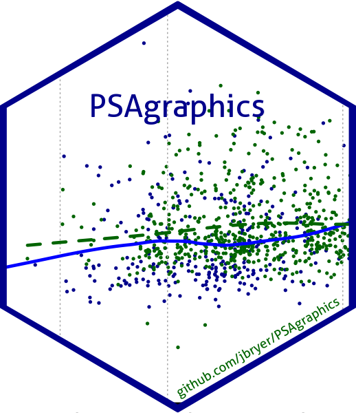

<!-- README.md is generated from README.Rmd. Please edit that file -->

```{r, include = FALSE}
knitr::opts_chunk$set(
  collapse = TRUE,
  comment = "#>",
  fig.path = "man/figures/README-",
  out.width = "100%"
)
```

#  PSAgraphics: An R Package to Support Propensity Score Analysis

<!-- badges: start -->
[](https://github.com/jbryer/PSAgraphics/actions/workflows/R-CMD-check.yaml)
`r badger::badge_devel("jbryer/PSAgraphics", "blue")`
`r badger::badge_cran_release("PSAgraphics")`
`r badger::badge_cran_checks("PSAgraphics")`
<!-- badges: end -->

A collection of functions that primarily produce graphics to aid in a Propensity Score Analysis (PSA). Functions include: cat.psa and box.psa to test balance within strata of categorical and quantitative covariates, circ.psa for a representation of the estimated effect size by stratum, loess.psa that provides a graphic and loess based effect size estimate, and various balance functions that provide measures of the balance achieved via a PSA in a categorical covariate.

For more information, see and cite: 

Helmreich, J. E., & Pruzek, R. M. (2009). PSAgraphics: An R Package to Support Propensity Score Analysis. Journal of Statistical Software, 29(6), 1–23. https://doi.org/10.18637/jss.v029.i06

## Installation

You can install the development version of `PSAgraphics` like so:

``` r
install.packages('PSAgraphics')
```

or to download the latest development version:

``` r
remotes::install.packages('jbryer/PSAgraphics')
```

